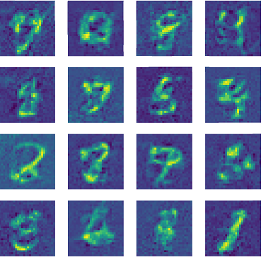
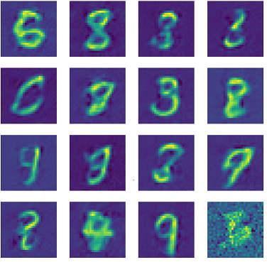
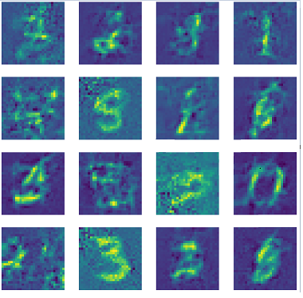

# Diffusion model

## Introduction

In this blog post we will develop from scratch an example of generative inverse diffusion model. The model aims to generate new realistic digit as seen in the MNIST dataset. 

The diffusion process consist in the progressive noising of a starting image. This is done in multiple steps via a controlled addition of noise. The added noise is sampled from the same distribution at each step and the resulting image is also rescaled to avoid exploding values. In the following image we can se this process in action:


During this procedure the information content of the starting image is progressively reduced and in the end we are left with pure white noise.

The inverse diffusion is the process that takes an image from any step of the procedure and aims to reconstruct the preceding step. This can be done with a purposely trained machine learning model. The sequential application of these models gives us a way transform a pure white noise image in a meaningful one.


## The data generation process

The training set need for these models is easy to obtain in principle, we just need to take a sample from the original dataset and add the noise sequentially. however this procedure is extremely inefficient since to obtain a sample an extremely noised image we must first calculate the preceding steps. Fortunately there is an easier way. This procedure is the hart of the diffusion model, so let's explore it.

The noise is generated from a gaussian distribution with mean 0 and variance 1.

$$ A_0: original~image $$

$$ N: random~noise ~~~ \forall i,j  ~~~ N_{i,j} = \mathcal{N}(1,0) $$

$$ A_n: image~at~the~n-th~noising~step $$

$$ \alpha: noise~scaling~factor $$

The first step of the diffusion process will be:

$$ A_1 = \alpha A_0 + N(1-\alpha)$$

If we apply multiple times the noising step, we can obtain a close form for the n-th generical image, $$A_n$$ .

$$ A_{n+1} = $$

$$= \alpha A_n + N(1-\alpha) = $$

$$= \alpha (\alpha A_{n-1} + N(1-\alpha))+ N(1-\alpha) =$$

$$= \alpha^2 A_{n-1} + N(1-\alpha^2) = $$

$$= ... = $$

$$= \alpha^n A_{0} + N(1-\alpha^n) $$

This close form is extremely useful since it allows us to obtain the n-th image of the diffusion process without calculation the preceding ones. 

$$\alpha$$, the noise scaling factor is an hyperparameter that will be close, but inferior to 1 (in our case $$\alpha = 0.99$$). We can see that as $$n \xrightarrow{}\infty$$ then $$A_{n} \xrightarrow{} N$$. In practice the information content of $$A$$ is lost well before infinity (in our case $$n = 500$$ will be enough).

Another trick that we will use is construction just a single machine learning model, $$\it{M}$$, to execute all the inverse diffusion steps. The model will take as inputs the noised image and the $$\alpha^n$$ parameter. The output will be a prediction of the added noise, without rescaling $$N$$. Therefore a single denoising step will be:

$$ N \approx \hat{N} = \it{M}(A_{n}, \alpha^n) $$

$$A_{n-1}= \frac{A_{n} - \hat{N}(1-\alpha)}{\alpha} $$

In the formulae above we see that, even if we have a prediction for $$N$$ at each step, we just remove from the starting full noise image just a portion of $$N$$. This is done because a the start of the inverse diffusion process we are really uncertain and the prediction is not reliable.

Let's give a look at the code used to add the noise: 

``` python
def add_noise(imm, alpha=0.9, n_max=100, n_repeat=1):
# n_repeat allows us to present the same image multiple times in the same batch with different type of noise!
    '''
This function is used add the noise to a set of images. The added noise is randomly scaled to correspond to a uniform choice of diffusion step between 0 and n_max.The resulting vector is a set of images with various noise level added.

## Inputs:
* imm: an numpy array of images. Shape: (n_images, size, size).
* alpha: scaling of the noise to add in one step. The more alpha is close to one the less noise is added at every step of the diffusion process.
* n_max: maximum number of steps of the diffusion process.
* n_repeat: if this parameter is different from 1 the same images is used n_repeat to generate noised images.

## Outputs:   
* noised_image: a numpy array of noised images. Shape: (n_images*n_repeat, size, size). This will be the main input of the ML algorithm.
* g_noise_to_add: a numpy array of the added noised, not rescaled by alpha. Shape: (n_images*n_repeat, size, size). This will be the target of the ML algorithm.
* array_alphas_n: a numpy array of the used alphas. Shape: (n_images*n_repeat,). This will be part of input of the ML algorithm.
    '''
    imm = np.tile(imm,(n_repeat,1,1))
    shape = imm.shape
    g_noise_to_add = np.random.randn(*shape)

    array_alphas_n = np.ones(shape[0])*alpha**np.random.randint(0,
                                                                n_max + 1,
                                                                shape[0]) 

    noised_image = np.einsum('i, ikj -> ikj', array_alphas_n,  imm) +\
             np.einsum('i, ikj -> ikj', 1-array_alphas_n,  g_noise_to_add)
    return noised_image, g_noise_to_add, array_alphas_n

```
We can see that the noise can be added simultaneously to an entire batch of images, the quantity of noise added (which corresponds to a particular step of the diffusion process) is randomly chosen. In this way are able to show, at each step of the fitting process, a good variety of different noising stages.  

The function above is used in the custom data generator:
``` python
class CustomDataGen(tf.keras.utils.Sequence):
    
    '''
This is the main CustomDataGenerator 
    '''
    
    
    def __init__(self, 
                 X,
                 y,
                 batch_size,
                 n_repeat=1,
                 alpha=0.9,
                 n_max=100):
            
        '''
This is the main CustomDataGenerator 

## Inputs:
* X: base dataset
* y: label list
* batch_size: batch size 
* n_repeat: if this parameter is different from 1 the same images is used n_repeat times to generate noised images.
* alpha: scaling of the noise to add in one step. The more alpha is close to one the less noise is added at every step of the diffusion process.
* n_max: maximum number of steps of the diffusion process.
        '''
        
        self.X = X
        self.y = y
        self.batch_size = batch_size
        self.n_repeat = n_repeat
        self.alpha=alpha
        self.n_max=n_max

   
    def __get_data(self, index):
        

        noised_imms, random_noise_to_add, alphas_n = add_noise(
            self.X[index:index+self.batch_size],
            n_repeat=self.n_repeat,
            alpha=self.alpha,
            n_max=self.n_max
            ) 

        out_noised_imms = np.zeros(
            shape=(noised_imms.shape[0],
            int((SIZE-2*OVER_PATCH)/PATCH_SIZE)**2,
            (PATCH_SIZE+2*OVER_PATCH)**2)
            ).astype('float32') 

        out_random_noise_to_add = np.zeros(
            shape=(random_noise_to_add.shape[0],
            int((SIZE-2*OVER_PATCH)/PATCH_SIZE)**2,
            (PATCH_SIZE+2*OVER_PATCH)**2)
            ).astype('float32')

        noised_imms = noised_imms.astype('float32')
        random_noise_to_add = random_noise_to_add.astype('float32')

        patched_noised_imm = patch_creation_vec(
            noised_imms, 
            out_noised_imms,
            out_noised_imms
            ).reshape(-1,
                      int((SIZE-2*OVER_PATCH)/PATCH_SIZE)**2,
                      (PATCH_SIZE+2*OVER_PATCH)**2
                      )
        
        # we concatenate to the patched images the used alphas_n
        return (np.concatenate([patched_noised_imm,
                                np.einsum('i, ikj -> ikj',
                                          alphas_n, 
                                          np.ones((patched_noised_imm.shape[0],
                                                   1,
                                                   patched_noised_imm.shape[2]
                                                   )
                                                 )
                                          ),

                               ],
                               axis=1),
              patch_creation_vec(
                random_noise_to_add,
                out_random_noise_to_add,
                out_random_noise_to_add
                ).reshape(-1,  
                          int((SIZE-2*OVER_PATCH)/PATCH_SIZE)**2,
                          (PATCH_SIZE+2*OVER_PATCH)**2))
    
    def __getitem__(self, index):

        return self.__get_data(index) 
    
    def __len__(self):
        return  math.floor(self.X.shape[0]/self.batch_size)

```
Since the model used is a *vision transformer* the custom data generator creates, using the starting images, the needed patches.


## The model
This model will be a vision transformer. We constructed two functions: one to create the needed patches and one to reconstruct the original image from the single patches.

* Patching:
    ``` python
    #this is the most efficent

    @guvectorize([(float32[:,:,:], float32[:,:,:], float32[:,:,:])],
                "(m, n, n), (m, q, p)->(m, q, p)", nopython=True)       
    # note the trick used to ouput a matrix with dimensions q and p, that never appears in the input!
    # this is probably just a limitation of numba
    # also note the fact that guvectorize does not have a return! the output arguments has to be the last input! 
    def patch_creation_vec(images, out, out_1):

        '''
    This function is used to convert a set of images in their patched version. This function is vectorized for speed and can be used efficently in the data generator.

    ## Inputs:
    * images: a numpy array of shape (n_images, size,size).
    * out_1: output array to be overwritten in the shape (n_images, (size/2)**2, 2, 2).
    * out: output array to be overwritten in the shape (n_images, (size/2)**2, 2, 2), this second input is needed because the the shapes (size/2)**2 and  4 do not appear in the first array.

    ## Outputs:   
    * an array of shape (n_images, (size/2)**2, 4).

    ### notes:
    1) The size must be an even number.
    2) Since the function uses guvectorize, the output will be returned via in-place modification of the last input argument.

        '''


        for m in range(images.shape[0]):
            c=0
            for i in range(int((SIZE-2*OVER_PATCH)/PATCH_SIZE)):
                for j in range(int((SIZE-2*OVER_PATCH)/PATCH_SIZE)):
                    # we need to use the ascontiguousarray function in order to be able to reshape the array in numba
                    out[m, c,:] = np.ascontiguousarray(
                        images[m,
                        i*PATCH_SIZE:i*PATCH_SIZE+PATCH_SIZE+2*OVER_PATCH,
                        j*PATCH_SIZE:j*PATCH_SIZE+PATCH_SIZE+2*OVER_PATCH]
                        )\
                        .reshape((PATCH_SIZE+2*OVER_PATCH)**2)
                    c+=1 
    ```
    This function is highly optimize, and uses Numba to parallelize and compile the code. This was needed because this function has to run many times during the training process.

* Reconstruction:
    
    ``` python
    def recompose(patched_image):
        '''
    This function is used to recompose an image from its pathced version.

    ## Inputs:
    * patched_image: a numpy array of shape ((size/2)**2, 4).

    ## Outputs:   
    * an array of shape (size, size).

    ### notes:
    1) The size must be an even number.

        '''
        recomposed = np.zeros(shape=(SIZE,SIZE))
        counts = np.zeros(shape=(SIZE,SIZE))

        c = 0
        for i in range(int((SIZE-2*OVER_PATCH)/PATCH_SIZE)):
            for j in range(int((SIZE-2*OVER_PATCH)/PATCH_SIZE)):
                recomposed[i*PATCH_SIZE:i*PATCH_SIZE+PATCH_SIZE+2*OVER_PATCH,
                        j*PATCH_SIZE:j*PATCH_SIZE+PATCH_SIZE+2*OVER_PATCH] =                        
                (patched_image[c].reshape(PATCH_SIZE+2*OVER_PATCH,
                                        PATCH_SIZE+2*OVER_PATCH))+\
                recomposed[i*PATCH_SIZE:i*PATCH_SIZE+PATCH_SIZE+2*OVER_PATCH,
                            j*PATCH_SIZE:j*PATCH_SIZE+PATCH_SIZE+2*OVER_PATCH]
                c+=1
                counts[i*PATCH_SIZE:i*PATCH_SIZE+PATCH_SIZE+2*OVER_PATCH,
                        j*PATCH_SIZE:j*PATCH_SIZE+PATCH_SIZE+2*OVER_PATCH] += 1
        
        recomposed = recomposed/counts

        return recomposed
    ```
    We didn't need to optimize the reconstruction function. 

There are three fundaments hyperparameters in this step: 
* **PATCH_SIZE**: the dimension of the square patch to feed the transformer
* **OVER_PATCH**: the number of rows and columns that will be shared between patches
* **SIZE**: the dimension of the original squared image (for MNIST is 28)

The used model is the following:
``` python
# this keras layer is used to add a trainable positional enconding to the patches!
class PositionPatchEncoder(tf.keras.layers.Layer):
    def __init__(self):
        super(PositionPatchEncoder, self).__init__()
        self.position_embedding = tf.keras.layers.Embedding(
            input_dim=int((SIZE-2*OVER_PATCH)/PATCH_SIZE)**2,
            output_dim=(PATCH_SIZE+2*OVER_PATCH)**2)

    def call(self, patch):
        positions = tf.range(start=0,
                             limit=int((SIZE-2*OVER_PATCH)/PATCH_SIZE)**2+1,
                             delta=1)
        encoded = patch + self.position_embedding(positions)
        return encoded
    
def create_model():
    
    input_tensor = tf.keras.Input(
        shape=[int((SIZE-2*OVER_PATCH)/PATCH_SIZE)**2+1,
               (PATCH_SIZE+2*OVER_PATCH)**2])

    # Adding the positional encoding  
    x_start = PositionPatchEncoder()(input_tensor)

    # The use of residual connections has been instrumental in the agorithm actualy learning
    x_mod = tf.keras.layers.MultiHeadAttention(
        num_heads=20, key_dim=100)(x_start, x_start)
    x = tf.keras.layers.Add()([x_mod, x_start])
    x_mod = tf.keras.layers.MultiHeadAttention(
        num_heads=20, key_dim=100)(x, x)
    x = tf.keras.layers.Add()([x_mod, x_start])
    x_mod = tf.keras.layers.MultiHeadAttention(
        num_heads=20, key_dim=100)(x, x)
    x = tf.keras.layers.Add()([x_mod, x_start])

    out = tf.keras.layers.Lambda(
        lambda x: x[:,:int((SIZE-2*OVER_PATCH)/PATCH_SIZE)**2])(x)

    temp_model = tf.keras.Model(inputs=input_tensor, outputs=out)
    
    return temp_model
```

## Model use

We have already described the process of inverse diffusion and the use of a single, parametrized model instead of a multiple models approach. 

There is a technique that can be used to improve the results of this generation process. This is the scaling of the step size. This amounts to increase the number of steps taken for each noise prediction. 

$$ N \approx \hat{N} = \it{M}(A_{n}, \alpha^n) $$

$$A_{n-1}= \frac{A_{n} - \hat{N}(1-\alpha^{STEP\_SIZE})}{\alpha^{STEP\_SIZE}} $$

In layman's terms this is basically equivalent to an increase in the trust given to the model prediction. We tested with $$STEP\_SIZE=1.5$$

This image generating process can be slow, this is because the model has to be applied over and over again in sequence. Is possible to reduce the numbers of steps at the expense of image quality. Let's consider the maximum $$\alpha^n$$ presented to the model in training (in our case $$\alpha=0.99$$ and $$n_{max}=500$$). Chosen a new number of steps, called $$n'_{max}$$, is possible to calculate the new needed corresponding $$\alpha'$$ as:

$$ \alpha' = \alpha^{\frac{n_{max}}{n'_{max}}} $$


Inference code example:
``` python
noised_imm = np.random.randn(SIZE, SIZE) 

ALPHA = ALPHA2
N = N_2
STEP = 1
print(ALPHA**N)

for n in range(N, 0 ,-STEP):
    if n%(100*STEP) == 0:
        plt.imshow(noised_imm)
        plt.show()
        print(n)
    alpha = (ALPHA)**n
    patched_n_imm = patch_creation(noised_imm.reshape(SIZE,SIZE))
    noise_pred = temp_model.predict(
        np.concatenate([patched_n_imm.reshape(1,
                                              patched_n_imm.shape[0],
                                              (PATCH_SIZE+2*OVER_PATCH)**2),
                        alpha*np.ones((1,1,(PATCH_SIZE+2*OVER_PATCH)**2))
                        ],
                        axis=1))\
        .reshape(int((SIZE-2*OVER_PATCH)/PATCH_SIZE)**2,
                 (PATCH_SIZE+2*OVER_PATCH)**2)


    noised_imm = noise_remove(
        recompose(noise_pred.reshape(
            int((SIZE-2*OVER_PATCH)/PATCH_SIZE)**2,
            (PATCH_SIZE+2*OVER_PATCH)**2
            )
        ),
        noised_imm.reshape(SIZE,SIZE),
        alpha=ALPHA,
        n=1.5*STEP
    )

plt.imshow(noised_imm)
plt.show()

```
## A selection of results

Example of whole denoising process:


Examples of images reconstructed **without step size** scaling and $$n_{max}=500$$:



Examples of images reconstructed **with step size** scaling of $$1.5$$ and $$n_{max}=500$$:



Examples of images reconstructed **without step size** scaling and $$n_{max}=50$$:



Examples of images reconstructed **with step size** scaling of $$1.5$$ and $$n_{max}=50$$:


## Final note
All the code and the trained model can be found [here](https://github.com/piantedosi/diffusion_from_scratch)

[back home](https://piantedosi.github.io/)
