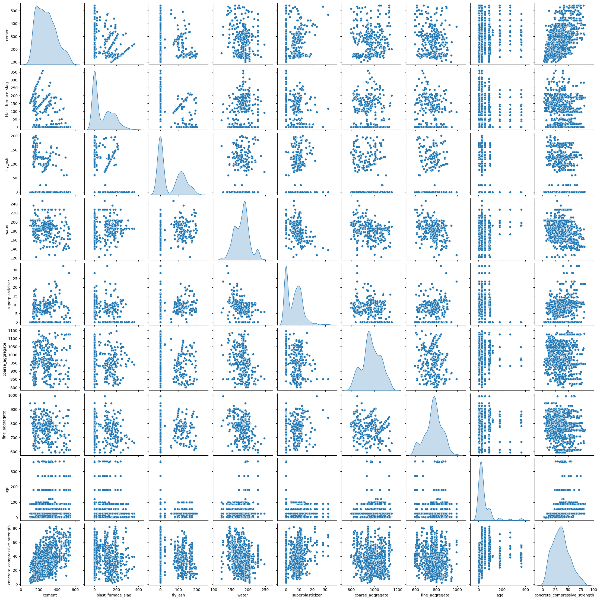
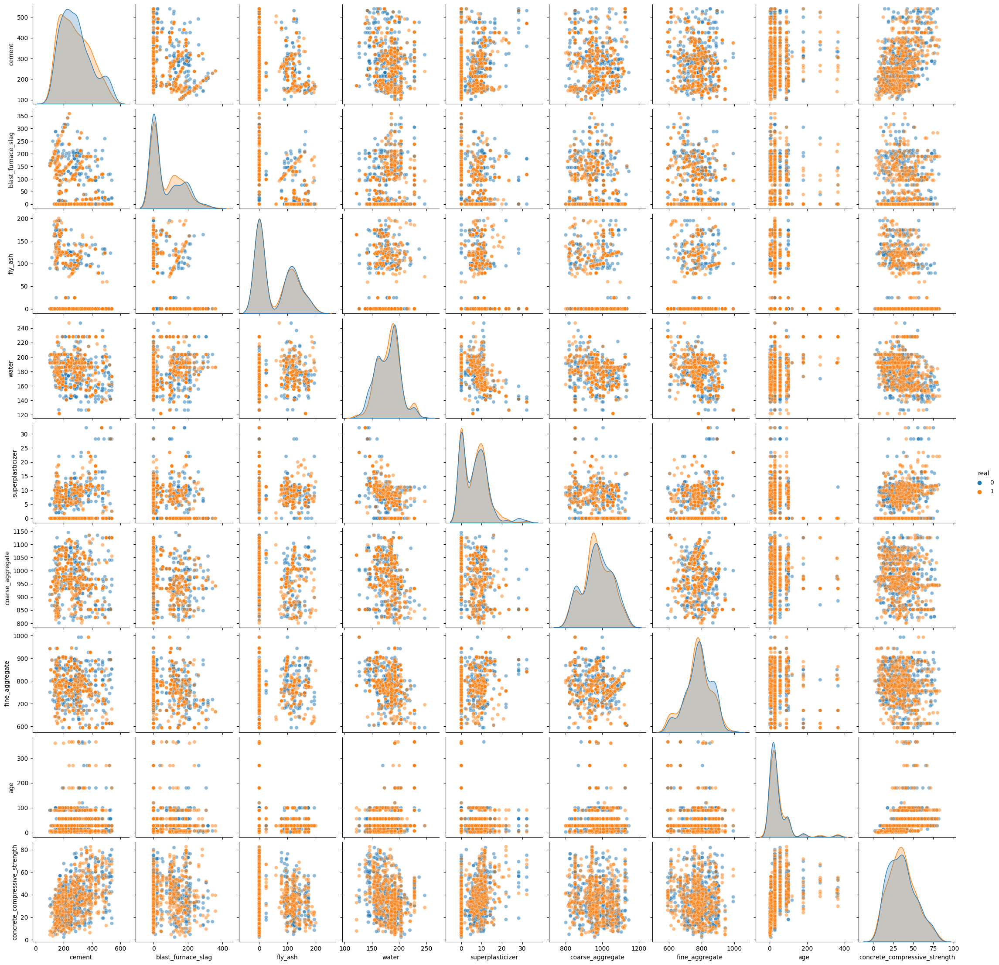
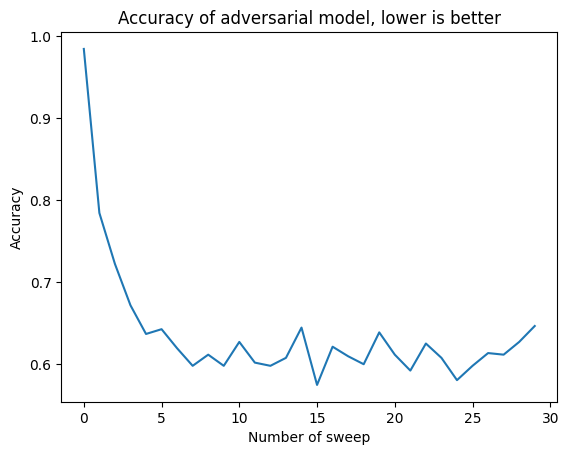

# Gibbs sampling and generative models
Gibbs sampling is a technique native to Bayesian statistics, it can be used to sample from a complex, unknow n-dimensional distribution, usually called *joint distribution*, $$f(x_1,...,x_n)$$, using simpler and known *marginal distributions*:
$$ f(x_1|x_1,x_2,....x_n) $$
$$ f(x_2|x_1,x_3....x_n) $$
$$...$$
$$ f(x_n|x_1,x_2....x_{n-1}) $$

The algorithm is a simple loop on the marginal distributions until convergence.

```
INPUTS:
f(x_1|x_2,x_3,...,x_n): marginal distribution 
f(x_2|x_1,x_3,...,x_n): marginal distribution 
...
f(x_n|x_1,x_2,...,x_{n-1}): marginal distribution 

BEGIN:
    x_1 := random initialization
    x_2 := random initialization 
    ... 
    x_n := random initialization

    REPEAT:
        x_1 := sampled from f(x_1|x_2,x_3,...,x_n)
        x_2 := sampled from f(x_2|x_1,x_3,...,x_n)
        ...
        x_n := sampled from f(x_n|x_1,x_2,...,x_{n-1})
    UNTILL {number of sweep reached}
END
```

Under some simple assumptions we can guarantee that the outputs $$(x_1,...,x_n)$$ will behave as if they come from the joint distribution $$f(x_1,...,x_n)$$.
This algorithm is particularly useful in Bayesian statistics where the joint distribution is often intractable, but the marginals are easier. We will explore another use of this tool, the creation of a generative model starting with some simple supervised learning models.

## Bootstrapping and the empirical marginal distribution

The key observation is that any supervised model can be transformed in a marginal distribution using bootstrapping. Let's take a set of $$k$$ samples coming from $$f(x_1,...,x_n)$$ called $$X$$:

$$ X = \{(x_{1,i},...,x_{n,i})\}_{1,...,k}$$
$$ (x_{1,i},...,x_{n,i}) \sim f(x_1,...,x_n)~~~\forall i=1,...,k$$

The process of bootstrapping consist in training a multitude of models on different dataset sampled with replacement from $$X$$. Suppose we trained $$m$$ different models for each variable $$n$$ $$\bf{M}$$ $$=\{M_{i,j}\}_{\substack{\text{i=1,...,n} \\ \text{j=1,...,m}}}$$. 

Let's focus on a single variable for example $$x_1$$, we have $$m$$ different models to predict this $$x_1$$ using $$x_2,x_3,...,x_n$$ therefore given some fixed $$x_2,x_3,...,x_n$$ we will have a set of $$m$$ different prediction for $$x_1$$. 

$$\hat{x}_{1,1} = M_{1,1}(x_2,x_3,...,x_n)$$
$$\hat{x}_{1,2} = M_{1,2}(x_2,x_3,...,x_n)$$
$$...$$
$$\hat{x}_{1,n} = M_{1,1}(x_2,x_3,...,x_n)$$

These $$\{\hat{x}_{1,j}\}_{j=1,...,m}$$ give us an estimate for the marginal distribution, we will call it the **empirical marginal distribution**. This has the advantage that we can sample from it and this is true for all variables $$x_1,...,x_n$$.

To keep thing simple we will use as supervised model some simple decision three. Threfore the process of bootstrapping will give us a set of random forest predictors, one for each variable. We are not interested in the prediction of the random forests, but in the distribution of the prediction of each single base predictor.


## A test on cement dataset

We will use this technique to generate tabular data, the chosen dataset is the 
[Concrete Compressive Strength Data Set](https://archive.ics.uci.edu/ml/datasets/Concrete+Compressive+Strength). 

Let's look at a pair plot of the data:

As we can se the data are a mixture of discrete and continuous distributions.

With this function we split the data $$X = \{(x_{1,i},...,x_{n,i})\}_{1,...,k}$$ in a train $$X_{train} = \{(x_{1,i},...,x_{n,i})\}_{1,...,q}$$ and a test set $$X_{test}= \{(x_{1,i},...,x_{n,i})\}_{1,...,t}$$ (with $$t+q =k$$) and generate the models: 

```py
def models_creators(df, n_estimators=100, test_size = 0.5):
    ''' df: dataset to model
        n_estimators: number of estimator used for the empirical marginal 
        distribution
        test_size: test train split    
    '''
  df_train, df_test = train_test_split(df.values, test_size = test_size)

  models = list()

  for i, col_name in enumerate(df.columns):
    X = np.delete(df_train, i, axis=1)
    Y = df_train[:,i]
    reg = RandomForestRegressor(n_estimators=n_estimators, n_jobs=-1)
    reg.fit(X, Y)

    models.append(reg)

    X_test = np.delete(df_test, i, axis=1)
    Y_test = df_test[:,i]

    Y_test_pred = reg.predict(X_test)

    print(f'col_name: {col_name}, r2_score: {r2_score(Y_test_pred, Y_test)}')

  return models,  df_train, df_test
  ```
The training of the model is a simple matter of running this function.

In this loop we sample, from the empirical marginal distribution, a new dataset, $$\hat{X}_{test} = \{(\hat(x)_{1,i},...,x_{n,i})\}_{1,...,t}$$, as big as the test set.
```py
samples = list()
for s in range(515):
  # initialization of gibbs sampling from the traninig variable as if they were independent
  # x = [np.random.choice(df_train[:,i]) for i in range(9)]
  # uniform initialization
  x = [np.random.uniform(df_train[:,i].min(), df_train[:,i].max()) for i in range(9)]

  for n in range(12): # data generation loop, numer of sweep
    for i, x_i in enumerate(x):
      trees = models[i].estimators_
      est_to_use = np.random.randint(len(trees))
      x[i] = trees[est_to_use].predict([x[:i]+x[i+1:]])[0]
  samples.append(x)
  if s%50==0:
    print(s)
```
Note how two different initialization techniques have been tried, the results, one convergence is reached are basically the same.

Let's look at a pair plot that compares the generated data and the original data from the test set.


From this simple visual inspection we can se that the method seams to work, but in high dimensional setting, complex interaction cannot be shown in a simple pair plot. To further check the quality of the modelling we can use an adversarial model. 

We will also use this adversarial model to calculate how many sweeps are needed to get good enough data. 

## Adversarial modelling

Adversarial modelling is a technique that can be used to check if two different dataset are sampled from the same joint distribution. In our case we want to compare the generated dataset, $$\hat{X}_{test} = \{(\hat(x)_{1,i},...,x_{n,i})\}_{1,...,t}$$ and the test dataset $$X_{test}=\{(x_{1,i},...,x_{n,i})\}_{1,...,t}$$. To do this we construct a new dataset merging together these two dataset and adding a variable, which we will try to predict in a supervised learning process. This new variable will signal the origin of the specific data point. This new dataset will be model with the standard playbook of a supervised learning binary classification problem. The accuracy of this prediction will be the metric used to judge if the different dataset are sampled from the same joint distribution. An high accuracy, close to 1, means that the datasets are very distinguishable, a low accuracy, close to 0.5, means that the datasets are undistinguishable.

In the next plot we see how the adversarial accuracy decreases al the number of sweeps increases. 



As we can see around 10 sweeps of the Gibbs sampling process the generative model has reached plateau in the data generation ability.

## The sampling process visualized.
In orange the real data and in blue the generated data


[back home](https://piantedosi.github.io/)
