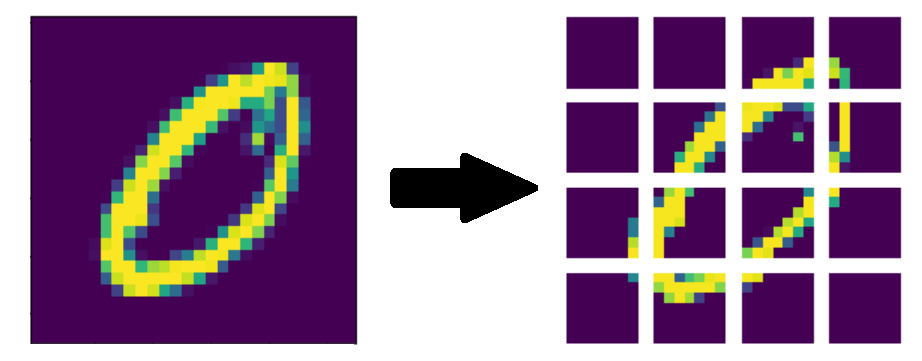
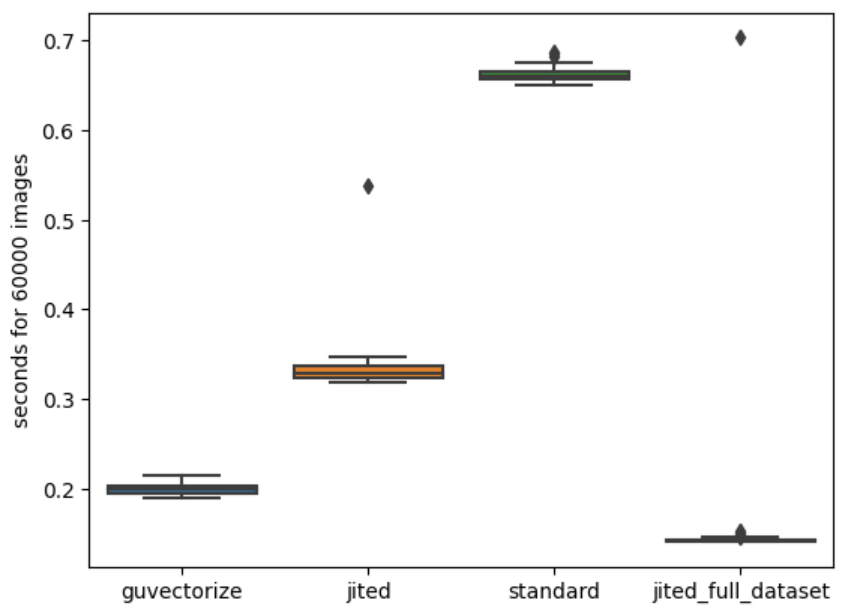

# Patch creation
In a previous [post](https://piantedosi.github.io/diffusion_model/) we explained how to build from scratch a diffusion model. The core model was a vison transformer and it needed a way to slice a single image in multiple patch. 



Since the images needed for training where generated by gaussian noising at training time they couldn't be pre-calculated. So it was essential having a fast way for this doing this process. In this post we will explore some ideas and, using Numba, vectorization and just in time compilation (JIT), we'll se how to get from 90000 images per second to 420000 images per second. 

## A first naive implementation

Let's start with a first naïve implementation that uses native python. This version can process 90677 images per second.
``` python
def patch_creation(image):
    '''this function takes an image of shape (SIZE,SIZE) and returns a tensor of the form: ((PATCH_SIZE/SIZE)^2, PATCH_SIZE^2)'''
    out = list()

    for i in range(patch_per_edge):
        for j in range(patch_per_edge):
            out.append(image[i*PATCH_SIZE:i*PATCH_SIZE+PATCH_SIZE, j*PATCH_SIZE:j*PATCH_SIZE+PATCH_SIZE])
    return np.array(out)
```

As we can see in this implementation we just take a single image and split it in the desired patches. 

## The simplest improvement

With JIT (just in time compilation) the situation improves, and this requires almost no effort on our part, just the introduction of a decorator, and a simple rewrite of the code so that the output array is a contiguous array. This version can process 181749 images per second.

``` python
@jit(nopython=True)
def patch_creation_jit(image):
    '''this function takes an image of shape (SIZE,SIZE) and returns a tensor of the form: ((PATCH_SIZE/SIZE)^2, PATCH_SIZE^2)'''
    
    out = np.zeros(shape=(patch_per_edge**2, PATCH_SIZE**2))
    c=0
    for i in range(patch_per_edge):
        for j in range(patch_per_edge):
            # we need to use the ascontiguousarray function in order to be able to reshape the array in numba
            out[c,:] = np.ascontiguousarray(image[i*PATCH_SIZE:i*PATCH_SIZE+PATCH_SIZE, j*PATCH_SIZE:j*PATCH_SIZE+PATCH_SIZE]).reshape(PATCH_SIZE**2)
            c+=1
    return out
```
## The guvectorize way
Another improvement can be obtained using vectorization. This allows us to parallelize the operations. This version can process 302145 images per second.

``` python
@guvectorize([(float32[:,:,:], float32[:,:,:], float32[:,:,:])],
             "(m, n, n), (m, q, p)->(m, q, p)", nopython=True)       
# note the trick used to ouput a matrix with dimensions q and p, that never appear in the input!
# this is probably just a limitation of numba
# also note the fact that guvectorize does not have a return! the output arguments has to be the last input! 
def patch_creation_vec(images, out, out_1):
    '''this function takes a tensor of images of shape (-1, SIZE, SIZE) and returns a tensor of the form: (-1, (PATCH_SIZE/SIZE)^2, PATCH_SIZE^2 where the 9 is the number of patch and the 36 are the patch features.

    This function is guvectorized and needs to recive the output variable as input (2 times, this is needed to output a custom different shape)'''

    for m in range(images.shape[0]):
        c=0
        for i in range(patch_per_edge):
            for j in range(patch_per_edge):
                # we need to use the ascontiguousarray function in order to be able to reshape the array in numba
                out[m, c,:] = np.ascontiguousarray(images[m, i*PATCH_SIZE:i*PATCH_SIZE+PATCH_SIZE, j*PATCH_SIZE:j*PATCH_SIZE+PATCH_SIZE]).reshape(PATCH_SIZE**2)#+1/(c+1)
                c+=1 
```
Note how the guvectorized functions does not have an output. The output is overwritten on one of the input arguments. This is the version used for the diffusion model. But there is a faster (and easier implementation).

## The fastest way
The reason why the jitted version was slow is that we forced the compiler to compile a function that process just one image at the time. If we move the dataset loop inside the JIT compiled function the situation improves dramatically. This version can process 421709 images per second.

``` python
@jit(nopython=True)
def patch_creation_jit_full_dataset(images):
    '''this function takes an image of shape (SIZE,SIZE) and returns a tensor of the form: ((PATCH_SIZE/SIZE)^2, PATCH_SIZE^2)'''
    image_patched = list()
    for im in list(images):
        out = np.zeros(shape=(patch_per_edge**2, PATCH_SIZE**2))
        c=0
        for i in range(patch_per_edge):
            for j in range(patch_per_edge):
                # we need to use the ascontiguousarray function in order to be able to reshape the array in numba
                out[c,:] = np.ascontiguousarray(im[i*PATCH_SIZE:i*PATCH_SIZE+PATCH_SIZE, j*PATCH_SIZE:j*PATCH_SIZE+PATCH_SIZE]).reshape(PATCH_SIZE**2)
                c+=1
    image_patched.append(patch_creation_jit(im))
    return out
```

## Results

In the following boxplot we can see the performance of each algorithm. Note how the first jit computation is always the slowest, this is because, before the first run, the function gets compiled and this requires time.



[back home](https://piantedosi.github.io/)
