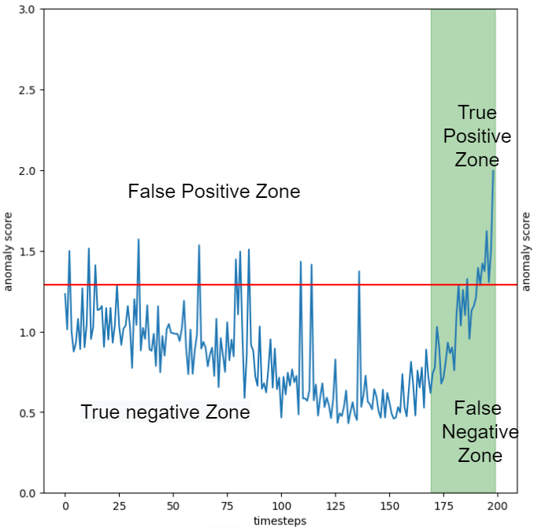

# Introduction of the problem

In this post we will explore the implication of using the standard metrics for a binary classification problem, in the context of continuous timeseries anomaly detection. The metrics we are interested in are: *precision* ($$p$$), *recall* ($$r$$), and their harmonic mean *f1-score*. To define these metrics we first need to introduce some definitions:

   - $$TP$$: True positive, the number of instances where the classifier returns *true* and the real value is *true*.
   - $$FP$$: False positive, the number of instances where the classifier returns *true* and the real value is *false*.
   - $$FN$$: False negative, the number of instances where the classifier returns *false* and the real value is *true*.
   - $$TN$$: True negative, the number of instances where the classifier returns *false* and the real value is *false*.

Then we define:

$$Precision = p = \frac{TP}{TP+FP}$$

$$Recall = r = \frac{TP}{TP+FN}$$

$$F1~score = 2 \frac{p~r}{p+r}$$

These metrics are typically used in the binary classification context. In that context the objective is, given some input variables, to predict a binary outcome. However they can easily be adapted, and often are, for other objectives.

Let's consider the context of continuous anomaly detection system. Here we have a continuous timeseries and we want to find, often in an online manner, if some points, in this timeseries, are in some way anomalous. The standard definitions of $$TP$$, $$FP$$, $$FN$$ and $$TN$$ on timeseries are given by fixing a *time window*, before the anomaly, where the given data points are considered positive. This choice of *time window* is often arbitrary and this makes difficult to interpret the performance of an algorithm. 

In the following image the positives timestep, inside the *time window*, are in the green region and the other are considered negatives.

## Example of the problem 
For this practical example we have build, using Pytorch, an autoencoder on the [turbofan dataset](https://ti.arc.nasa.gov/tech/dash/groups/pcoe/prognostic-data-repository/). For the training set only the segments 20 timesteps before the failure were used. In this way the autoencoder reconstruction error can be used as an anomaly score. Furthermore a threshold was calculated as the $$95th$$ percentile of the reconstruction error on a portion of the training set. The anomaly detector gives us a probable anomaly each time the reconstruction error is above this threshold. In this context we can easily define $$TP$$, $$FP$$, $$FN$$ and $$TN$$ in the way described above.

To understand the problem let's look at how these metrics change with the changing of the *time window*

{:height="33%" width="33%"}
{:height="33%" width="33%"}
{:height="33%" width="33%"}

Form these graphs we can deduce three things:
   - The precision increases as the *time window* increases. This is expected, since more timesteps will be considered positive they will be more easily identified.
  
   - The recall decreases as the *time window* increases. This is expected since more timesteps will be considered positive finding them all will be harder.

   - The f1-score has a maximum around a *time window* of 25.

The last fact is difficult to interpret. The *time window* size is not some hyperparameter of the machine learning algorithm. It is an hyperparameter of the metric! Choosing the values that get the best result seams just plain wrong. It would be akin to changing the coverage of a confidence interval until it covers the result we are looking for. 

Furthermore if we do a sanity check on the results we get that around a *time window* of 25 we have:

$$Precision \sim 0.65$$

$$Recall \sim  0.6$$

$$F1~score \sim  0.62$$

A quick look at the plots (figure below) gives us a completely different story. Every single anomaly is correctly identified, well before machine failure. Therefore the recall should, logically, be $$1$$. Meanwhile the precision should not be this high, since we clearly have many false positives. The problem is that these are obscured by the many true positives, near the failure, which fall inside the *time window*. If we had to stop production each time we had a false positive this model is unacceptable and the relatively high precision is clearly misleading.

These drawbacks are the reason why, whenever the accurate time of failure is know, the metric of RUL (Remaining Useful Life) is often used. However, we are not interested in the RUL; we are interested in a correct way to express precision and recall in this context.

## The solution 
The solution, to this problem, comes from two facts. The first is that in a continuous contexts the true negatives are meaningless and the second is that they are, anyway, not used in the definitions of precision and recall. Let's redefine:

   - $$TP$$: True positive, the number of instances where the anomaly score goes over the threshold and *does not* come back under until failure.
   - $$FP$$: False positive, the number of instances where the anomaly score goes over the threshold and *does* come back under before failure.
   - $$FN$$: False negative, the number of instances where the anomaly score *does not* go over the threshold when there is a failure.
   - $$TN$$: True negative, each instance where the anomaly score is under the threshold and there is no failure, but they do not matter.

If we recalculate precision, recall and f1-score, using these conventions we obtain:

$$Precision = 0.10$$

$$Recall = 1$$

$$F1~score = 0.18$$

These results give us a way better picture of the real performance of the anomaly detector. For example the precision tells us that, if we where to stop the machine every time we get an anomaly, we would be stopping the machine 10 times to get a single real anomaly. Meanwhile the recall tells us that we are sure to intercept basically all the failure. This is clearly more in line with the real results of the algorithm, as seen in the above plots.

The code with the autoencoder can be found at [back home](https://github.com/piantedosi/autoencoder_anomaly_detection)

[back home](https://piantedosi.github.io/)
