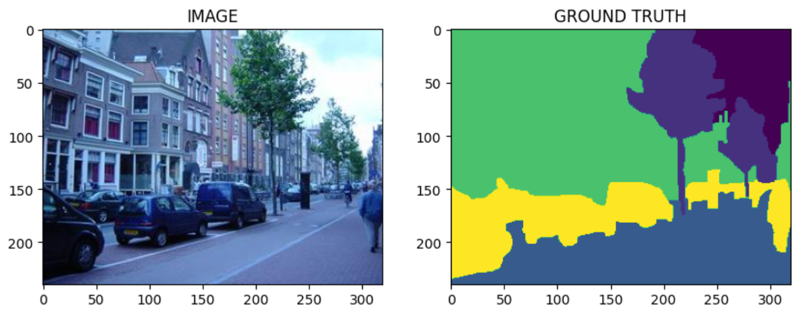
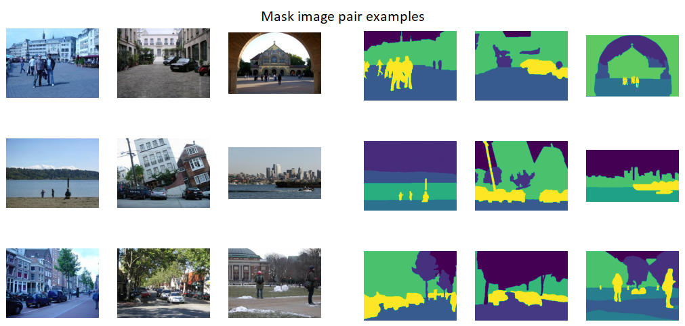
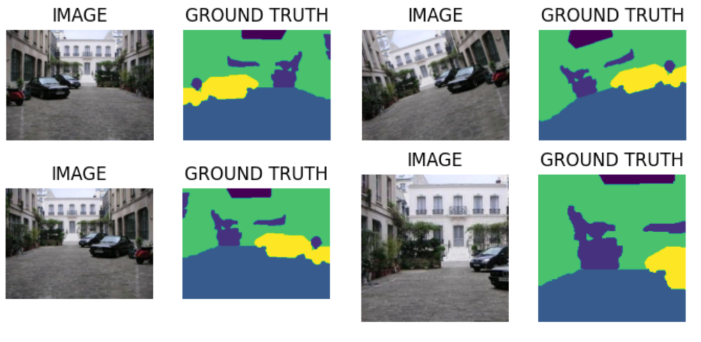
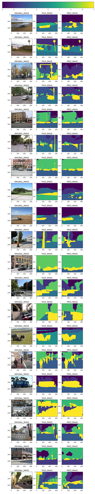

# Introduction to segmentation

Image segmentation is the task of dividing, a given image, in multiple "zones". Each zone corresponds to a different class, for example: sky, tree, road and building can all be different class. The segmented image is often called *mask* or ground truth. In other terms we can thought a segmentation problem as a multiclass classification problem applied to each pixel in an image.


In this post we will explore how to build an image segmentation algorithm in PyTorch. The dataset that we will use is the [Scene Understanding Datasets](http://dags.stanford.edu/projects/scenedataset.html). In this dataset there are 715 different images with relative mask regions. Each pixel can belong to eight different classes: sky, tree, road, grass, water, building, mountain, or foreground object plus a special class for unknow classification.


# Some data preparation

We need to correctly load the data this is done in the function below:
```py
def get_images_from_id(idx:int, df=df):
    '''this function takes a single image, mask pair from a given dataset'''    
    row = df.iloc[idx]

    image_path = DATA_DIR+'images/'+row.file_name+'.jpg'
    mask_path = DATA_DIR+'labels/'+row.file_name+'.regions.txt'

    image = cv2.imread(image_path)

    image = cv2.cvtColor(image, cv2.COLOR_BGR2RGB)
    mask = np.loadtxt(mask_path)

    return image, mask
```

Right now the masks are encoded with a single channel, and each class is indicated by a different integer. To construct an efficient segmentation algorithm we preferer the *one hot encoding* where each class has his own channel, and the belonging to that class is indicated by a 1 or a 0 in the specific channel. Therefore we need two function, one to transform mask in the one hot encoding and one to get back.

```py
def one_hot_encode(mask):
    '''this function transform the mask in the one hot encoded version'''
    out = np.zeros(shape=(*mask.shape, 9))
    for i in range(mask.shape[0]):
        for j in range(mask.shape[1]):
            if mask[i,j]>=0:
                out[i, j, int(mask[i,j])] = 1
            else:
                out[i,j, 8] = 1

    return out
```

```py
def one_hot_decode(mask):
    '''this function transform the one hot encoded version 
    on the mask in a plottable one'''
    out = np.zeros(shape=mask.shape[:-1])

    for i in range(mask.shape[0]):
        for j in range(mask.shape[1]):
            out[i][j] = mask[i, j, :].argmax()
            if out[i][j] == 8:
                out[i][j] = -1

    return out
```

After the test, train and validation split we have there dataset: 

- train_df size: 457
- valid_df size: 115
- test_df size: 143

The train dataset will be augmented with the Albumentation library, the test and validation dataset will just be resized.

```python
def train_aug():
    return A.Compose([        
        A.HorizontalFlip(p=0.5),
        A.augmentations.geometric.rotate.Rotate(limit=[-30,30]),
        A.augmentations.crops.transforms.RandomCrop(
            min_height,
            min_witdh,
            always_apply=False,
            p=0.1
            ),
        A.Resize(HEIGHT, WITDH),        
    ])

def valid_aug():
        return A.Compose([
        A.Resize(HEIGHT, WITDH)
    ])
```
Some example of augmentations:


## PyTorch dataset

We will create a PyTorch dataset that will take care of image preprocessing and augmentation. We will also define the dataloaders to load the data at training time.

```py
class SegmentationDataset(Dataset):

    def __init__(self, df, augmentations):
        self.df = df
        self.augmentations = augmentations
        
    def __len__(self):
        return len(self.df)
    
    def __getitem__(self, idx):

        image, mask = get_images_from_id(idx, self.df) #h,w,c
        mask = one_hot_encode(mask)
        
        if self.augmentations:
            data = self.augmentations(image = image, mask = mask)
            image = data['image'] #(h,w,c)
            mask = data['mask'] #(h,w,c)

        # allining with pytorch convention
        image = np.transpose(image, (2,0,1)).astype(np.float32) # (c, h ,w)
        mask = np.transpose(mask, (2,0,1)).astype(np.float32) # (c, h ,w)

        image = torch.Tensor(image) / 255.0
        mask = torch.Tensor(mask)
        return image, mask
  
trainloader = DataLoader(trainset, batch_size= BATCH_SIZE, shuffle=True)
validloader = DataLoader(validset, batch_size= BATCH_SIZE)
testloader = DataLoader(testset, batch_size= BATCH_SIZE)
```

## The model code
The model we will use is a U-net imported from the segmentation library of PyTorch.

```py 
import segmentation_models_pytorch as smp

ENCODER = 'timm-efficientnet-b0'
WEIGTHS = 'imagenet'
DEVICE = 'cuda'
class SegmentationModel(nn.Module):
    def __init__(self):
        super(SegmentationModel, self).__init__()

        self.backbone = smp.Unet(
            encoder_name = ENCODER,
            encoder_weights= WEIGTHS,
            in_channels = 3,
            classes = 9,
            activation = 'softmax',
         
        )

    def forward(self, images):
        logits = self.backbone(images)

        return logits

model = SegmentationModel()
model.to(DEVICE)
```
Now we need to define a train and validation function to be used in the training loop. Note how the validation function does not update the model. This is important to avoid overfitting.

```py
def train_f( dataloader, model, optimizer, loss_f):
    model.train()

    total_loss = 0.0

    for images, masks in tqdm(dataloader):
        images = images.to(DEVICE)
        masks = masks.to(DEVICE)

        optimizer.zero_grad()

        logits = model(images)

        loss = loss_f(masks, logits)
    
        loss.backward()

        optimizer.step()

        total_loss += loss.item()

    return (total_loss/ len(dataloader))

```

```py
def eval_f( dataloader, model, loss_f):
    model.eval()

    total_loss = 0.0

    with torch.no_grad():
        for images, masks in tqdm(dataloader):
            images = images.to(DEVICE)
            masks = masks.to(DEVICE)

            logits = model(images)

            loss = loss_f(masks, logits)

            total_loss += loss.item()

        return (total_loss/ len(dataloader))
```

Now let's look at the training loop.

```py
opt = torch.optim.Adam(model.parameters(), lr = LR)
loss_f = nn.CrossEntropyLoss()
current_loss = np.inf

for i in range(EPOCHS):
    t_loss = train_f(trainloader, model, opt, loss_f)
    v_loss = eval_f(validloader, model, loss_f)

    if v_loss < current_loss:
        torch.save(model.state_dict(), "model.pytorch")
        print('MODEL_SAVED')
        current_loss = v_loss

    print(f'EPOCH: {i + 1}, Train loss: {t_loss}, valid loss: {v_loss}')

```

we loop on the epochs and save the best model.

## Some results

Now that the training is complete we can look at some results. 



The model can clearly be improved, but this was just a proof of concept. The code can be found [here](https://github.com/piantedosi/segmentation)


[back home](https://piantedosi.github.io/)
